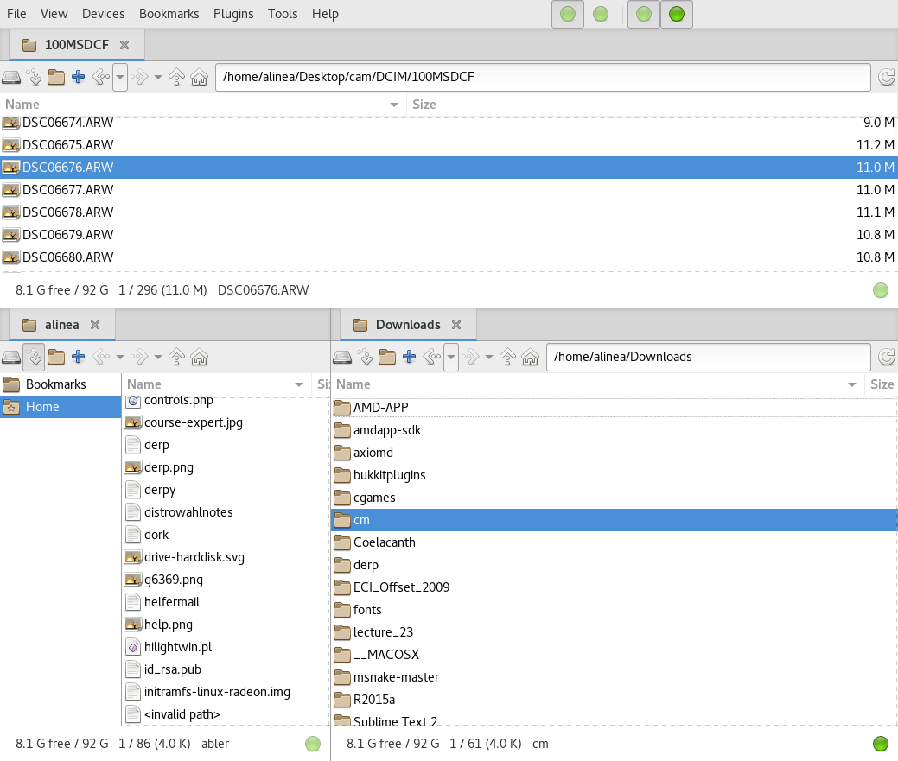

# Basics

## Basics 

###
\bigtext{Basics}

\notsobigtext{Stuff you can already do}

### Automatic updating and shutdown

```
$ sudo su
root's password:
$ zypper ref && zypper -n up && poweroff
```

* `sudo su`: Become root
* `zypper ref`: Update repository
* `zypper -n up`: Install upgrades
* `-n` stands for `no confirmation`
* `A && B`: Execute B if A completed successfully

### 
\bigtext{Replace anything!}

\notsobigtext{The package manager is your friend}

### Start menus
* xfce, kupfer, whisker, rofi

### Start menus: XFCE default

{ height=30% }

### Start menus: Whiskermenu

{ height=30% }

### Start menus: Kupfer

{ width=40% }\ { width=40% }

### Start menus: Rofi

{ width=100% }

### Clipboards
* glipper, copyq, xfce4-clipman

### Glipper

{ height=41% }

### Xfce4-Clipman

{ height=41% }

###\ 

{ height=41% }

### File Managers
* nemo, spacefm, ranger 

### File Managers: Nemo
* Typical graphical file manager

{ height=30% }

### File Managers: SpaceFM
* Graphical manager with a lot of features

{ height=30% }

### File Managers: Ranger
* Completely commandline based
* Even supports pictures (what?!)

{ height=30% }

### Drawing
* GIMP
* Krita
* Inkspace (for vector graphics)

### Krita
* Digital painting and animation
* FOSS

{ height=30% }
