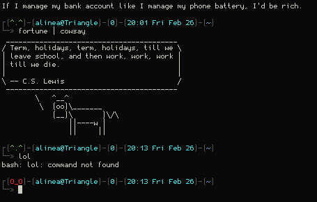
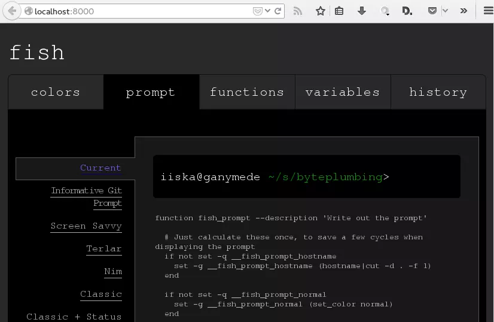
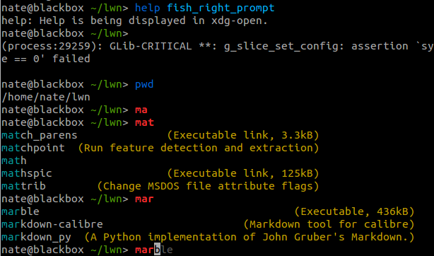
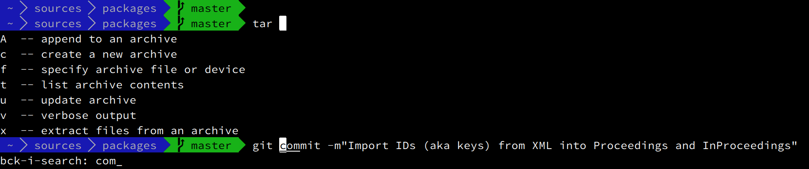
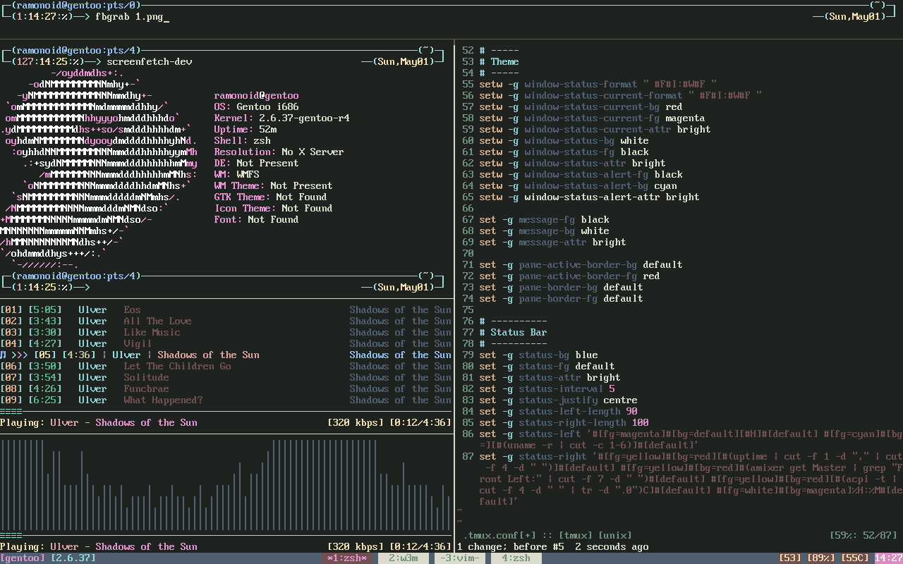
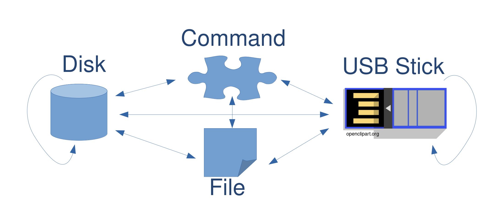

# Advanced

## Advanced

###
\bigtext{Advanced}

\notsobigtext{Doable after some reading}

### Shells
* bash, fish, zsh
* Tmux

### Shells: Bash
* Standard shell on many distributions
* Configure using `.bashrc`

{ height=30% }

### Shells: Fish
* *F*riendly *i*nteractive *sh*ell
* Configure in webbrowser
* Autocompletion shows while typing

###

{ width=41% }\ { width=41% }

### Shells: Zsh
* Nowadays, most advanced shell
* Plugins and themes with "oh-my-zsh"
* Incredibly configurable

###

{ width=90% }

### Tmux
* Tmux is not a shell
* ...but a *container* for shells
* Provides shell "sessions"

{ height=30% }

### dd
* Bitwise copy: Create exact copies on low level
* Can pipe to commands, e.g. `pbzip2`

{ height=30% }

### dd
* `if=` and `of=` for input and output file
* `bs=4M` for faster copy

### dd
* `sudo dd if=openSUSE.iso of=/dev/sdb bs=4M`
  Input file is openSUSE image
  Output file is /dev/sdb (a USB stick)

### pbzip2
* `pbzip2` is like zip, but multicore
* Can be used with `dd`

### dd and pbzip2
* Copy and compress `/dev/sda` partition to `archive.img.pbzip`:
  `sudo dd if=/dev/sda1 | pbzip2 > archive.img.pbzip`

### How to backup?
* With `rsync`
* Can backup onto an external harddrive, NAS, Internet...

### What to backup
* User files: `/home/user`
* System files: `/etc`, `/opt`, `/boot`, `/var`, `/root`, `/usr`

### VPN using openconnect (Demo)
* Install openconnect: `sudo zypper in NetworkManager-openconnect`
* Click on icon -> VPN Connections -> Configure VPN
* Add new connection with openconnect

### mpv
* Mediaplayer
* Controlled by keyboard
* Can run in console

### youtube-dl
* Download YouTube videos
* `youtube-dl -x <URL>` to download audio only
* `youtube-dl "youtube.com/watch?v=dQw4w9WgXcQ"`

### mpv + youtube-dl
* `mpv <URL>` plays YouTube video!

### ffmpeg
* Easily convert between video formats:  
    `ffmpeg -i input.avi out.mp3`

<!-- demo with that's got to be the best pirate -->

### Merge PDFs

* `pdfunite [SOURCES] [DEST]`  
    For example: `pdfunite intro.pdf appendix.pdf out.pdf`  
    For example: `pdfunite course*.pdf out.pdf`

### Separate PDFs
* Separate a whole book into pages:  
    `pdfseparate book.pdf page%d.pdf`

* Extract one page:  
    `pdfseparate -f 5 -l 5 book.pdf page.pdf`

### Power consumption
* `powertop`
	* See exact information
	* Tune parameters
	* Calibrate battery

* `cpupower`
	* See what cpu is doing
	* See frequencies etc.

### Recover lost data
* `photorec`
	* Works on broken filesystems
	* Recovers videos, documents...
	* ~300 file families supportede

* `dd_rescue`
	* Copies data (like dd)
	* Automatically skips unreadable blocks(!)
	* Pulls data from almost dead harddisk

### xrandr
* Control display size etc.
* Put projector on auto-resolution:
	* `xrandr --output VGA-0 --auto`
	* `xrandr --output VGA-0 --auto --left-of LVDS`

### feh
<!-- TODO: Remove?-->
* Set a random wallpaper:  
    `feh --bg-fill --randomize ~/Images`

### ssh
* Encrypted connection to remote machine
	* `ssh [USERNAME]@[HOSTNAME]`
	* `ssh nils@192.168.1.1`

### scp
* Copy files (securely)

### rsync (again)
* `rsync -avh Downloads/ nils@192.168.1.1:media`

### Look at logs
* Under `/var/log`

### Cronjobs
* Schedule jobs, e.g. daily, weekly...
* Command: `crontab`
