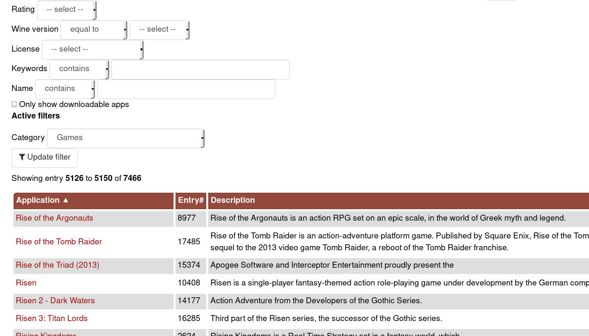

# Expert

## Expert

###
\bigtext{Expert}

\notsobigtext{Concepts needing some experience}

### Development
* Very tight integration on commandline
* Easy access to software
	* Through package manager
	* Through github

### Easy programming in...
* Java
* C, C++
* Ruby
* Python
* Haskell
* ...

### Github
* Incredibly big repository
* Community-driven
* Download software with `git clone <URL>`

### Write a webserver
<!-- TODO -->
* Activate HTTP server with `systemctl enable httpd`

### Gaming
* Steam is nearing ~25% Linux support
* WINE

### WINE
* "Emulator" for Windows
* Not only for games
* Works well for most programs
* [WineHQ](https://www.winehq.org): Giant database keeping track of what works

{ height=30% }

### WINE
* Better support for Windows games than Windows itself!\footnote{For older games}

###

{ height=41% }

### Gaming outlook
* Valve still actively pushing Linux
* Vulkan (cross-platform API) supported by big game engines
	* Unreal Engine
	* CryEngine
	* Unity
